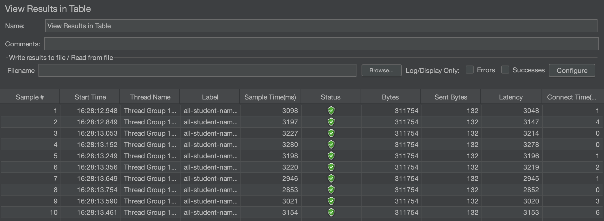

# Module 5

## JMETER before optimization

- ### `all-student-name`

- ### `highest-gpa`

## JMETER after optimization

- ### `all-student-name`

- ### `highest-gpa`

## Command Line

- ### `all-student-name`

- ### `highest-gpa`

**Conclusion**

After profiling the application, making targeted optimizations, and re-running the JMeter tests, we observed significant 
improvements in response times for both endpoints. The endpoint that initially had a higher response time now responds 
considerably faster, and even the endpoint with the lower initial response time shows further gains. These results confirm 
that the performance optimizations are effective overall.

## Reflection
1. What is the difference between the approach of performance testing with JMeter and profiling with IntelliJ Profiler in 
the context of optimizing application performance?

JMeter simulates real-world user traffic to measure overall system performance such as throughput, latency, and error rates 
under load, providing a macro view of how the application behaves in production. Meanwhile, IntelliJ Profiler examines 
the internal execution of the application, offering a micro view by tracking CPU usage, memory allocation, and method-level 
performance to identify specific bottlenecks in the code.

2. How does the profiling process help you in identifying and understanding the weak points in your application?

Profiling provides detailed insights into which parts of the code consume the most resources by monitoring method execution 
times, memory usage, and CPU cycles. This  information helps pinpoint inefficient code paths and resource-heavy 
operations, allowing developers to target and optimize the specific areas that are causing performance issues.

3. Do you think IntelliJ Profiler is effective in assisting you to analyze and identify bottlenecks in your application code?

IntelliJ Profiler is quite effective in analyzing and identifying bottlenecks because it delivers real-time metrics on 
various aspects of code performance. Its detailed breakdown of method calls and resource usage helps developers quickly 
spot and understand inefficiencies, making it a valuable tool when combined with other performance testing methods.

4. What are the main challenges you face when conducting performance testing and profiling, and how do you overcome these 
challenges?

One main challenge is replicating real-world usage scenarios accurately while dealing with the complexity of modern applications, 
which often results in inconsistent or overwhelming data. Overcoming these challenges involves refining test scenarios, 
using both macro-level and micro-level tools for cross-validation, and conducting multiple rounds of testing to isolate 
and confirm the root causes of performance issues.

5. What are the main benefits you gain from using IntelliJ Profiler for profiling your application code?

Ability to provide a detailed, code-level view of resource consumption, which makes it easier to identify inefficient 
routines and bottlenecks. This level of insight not only speeds up the debugging process but also helps in making targeted 
optimizations that can significantly improve overall application performance.

6. How do you handle situations where the results from profiling with IntelliJ Profiler are not entirely consistent with 
findings from performance testing using JMeter?

I reconcile the differences by reviewing and aligning testing scenarios, cross-validating metrics, and performing additional 
tests. This combined approach ensures that both macro-level performance and micro-level execution details are considered, 
helping to identify the true bottlenecks accurately.

7. What strategies do you implement in optimizing application code after analyzing results from performance testing and 
profiling? How do you ensure the changes you make do not affect the application's functionality?

I focus on strategies such as refactoring inefficient code, optimizing database queries, and improving caching mechanisms. 
To ensure these changes don’t affect the application's functionality, I rigorously run unit and integration tests, use 
version control for safe rollbacks, and deploy updates incrementally to monitor their real-world impact.
